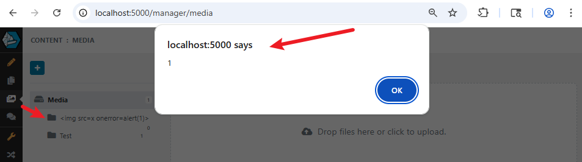

# Piranha CMS – XSS via Media Folder Name

**Affected product:** Piranha CMS  

**Vulnerability type:** Cross-Site Scripting (XSS)

## Description

Piranha CMS v12.1 contains a cross-site scripting (XSS) vulnerability in the **Media** page related to the handling of media folder names. The application does not properly sanitize user-supplied input in the **Name** field when creating or editing media folders.

An authenticated user can inject malicious JavaScript into the folder name, which is stored and executed when the folder entry is created or when a user clicks the **Edit** button and then **Done** without making any changes.

## Affected Version

- **Piranha CMS:** v12.1

## Affected Component

- **Media Page** (Folder Name field)

## Proof of Concept (PoC)

1. Log in to Piranha CMS as an authenticated user via `/manager/login`.  

2. Navigate to the **Media** page.  

3. Create a new folder and insert a JavaScript payload into the **Name** field, then press **Enter**.  

4. Observe that the injected JavaScript executes, confirming a XSS vulnerability.

## Notes

- The issue can be triggered again by clicking the **Edit** button on the folder and then selecting **Done** without making any changes.

